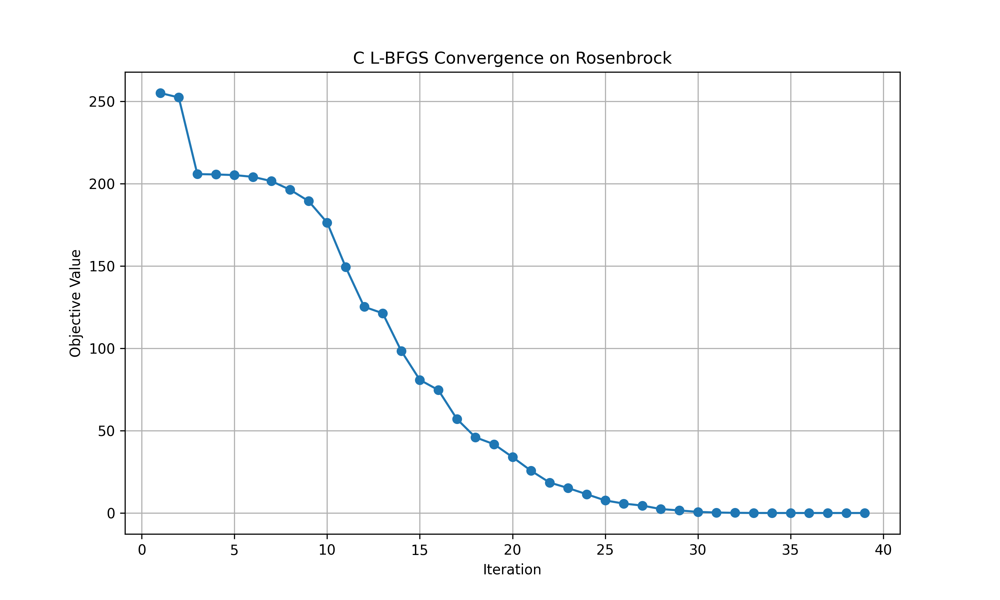
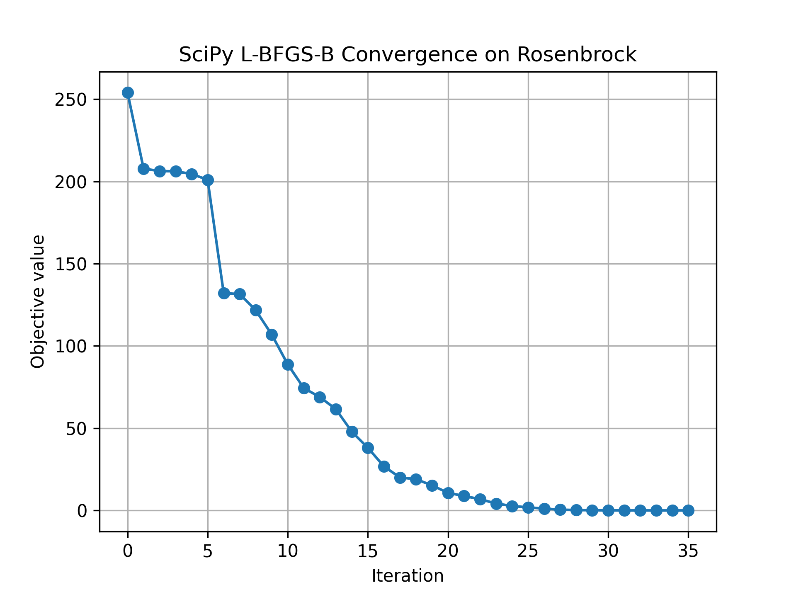

## Matrix-Free L-BFGS Optimization in C

### Overview:
This project implements a matrix-free L-BFGS optimization algorithm in C, specifically optimized for the 1000-dimensional Rosenbrock function. It also extends to a physically realistic heat diffusion PDE solver for demonstrating the real-world advantage of C over Python for large-scale numerical simulations.

---

## Section 1 (-b main): High-dimensional Rosenbrock Optimization

### Key Features:
- Matrix-free L-BFGS implementation.
- Objective function: High-dimensional Rosenbrock.
- Fully parallelized gradient computation using OpenMP. 
- Supports flexible convergence criteria.
- Lightweight design: No external libraries required (other than OpenMP).

### Performance Benchmark:
- Compared against SciPy's L-BFGS-B implementation.
- Test case: 1000-dimensional Rosenbrock function.
- Results:
    - C Implementation: 0.000316 seconds
    - SciPy Implementation: 0.0101 seconds
- Speedup: ~32x faster than Python baseline.

### L-BFGS ConvergenceConvergence Plots:
     

These plots demonstrate the objective function reduction over iterations for both implementations.

---

## Section 2 (-b develop): Heat Diffusion PDE Solver

### Overview:
In addition to the synthetic Rosenbrock test case, this project implements a physically realistic **2D Heat Diffusion PDE Solver** using an explicit finite difference scheme. This is a classic example from computational physics, where performance bottlenecks in Python become serious at large grid sizes.

### Problem Setup:
- Solving: ∂T/∂t = α (∂²T/∂x² + ∂²T/∂y²)
- Grid size: 512 x 512
- Time steps: 5000 per simulation
- Number of independent simulations: 100

---

### Performance Benchmark:
- Python implementation (NumPy + loops):
    - Time: **~3 hours** (11252 seconds) for 10 simulations.
- C implementation (OpenMP parallel loops):
    - Time: **~104 seconds** for 100 simulations.
- Effective speedup: ~**105x faster than Python**.

### Plots:
#### Runtime Comparison


---

### Directory Structure:
- src/
    - main.c          # Entry point for L-BFGS optimization
    - optimizer.c     # L-BFGS implementation
    - objective.c     # Rosenbrock objective and gradient
    - pde_main.c      # Entry point for PDE solver
    - pde_solver.c    # Heat diffusion solver (finite difference)
    - optimizer.h     # Header for L-BFGS
    - objective.h     # Header for Rosenbrock
    - pde_solver.h    # Header for PDE solver
- Makefile            # Build automation

---

### How to Build and Run:

#### 1. L-BFGS Optimizer (Rosenbrock)
```bash
make clean
make lbfgs
./lbfgs_optimizer
```

#### 2. Heat Diffusion PDE Solver
```bash
make clean
make pde
./pde_optimizer
```

---

### System Requirements:
- macOS (tested on Apple Silicon - M2)
- clang with OpenMP support
- Make utility
- Python 3.x (for benchmarking & plotting)

---

### Technical Highlights:
- Matrix-free formulation avoids explicit inverse Hessian storage.
- OpenMP parallelism for gradient computation and PDE updates.
- Minimal overhead through low-level memory management.
- Demonstrates how to embed C into performance-critical sections of scientific Python pipelines.

---

### Final Takeaway:
This project is a clear example of how to **offload computational bottlenecks to C while keeping the rest of the pipeline in Python**. This is ideal for researchers, data scientists, and engineers who want **scientific computing without the performance compromises of Python alone**.
